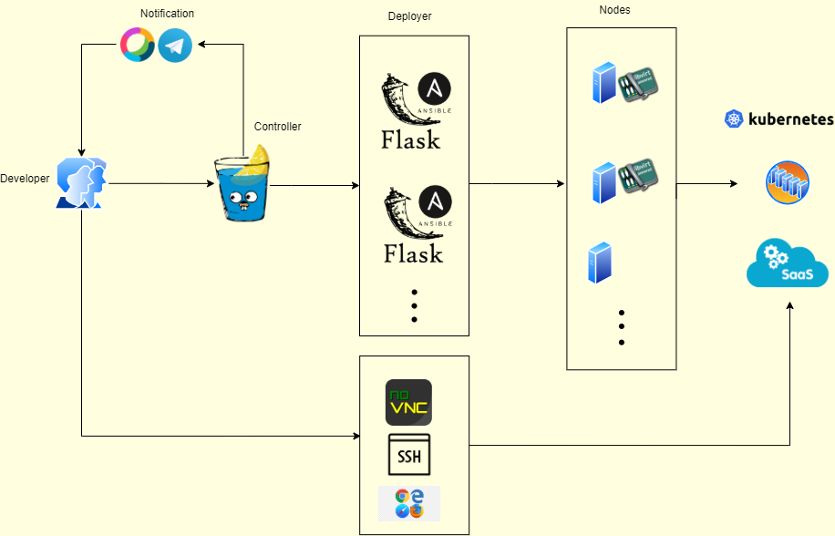

# DevLab
## Overview
The basic idea is to give a web portal for develper  which can support create VM, k8s, some middle softwares in an very fast and simple way

## Architecture Diagram


## Features
- Virtual Machine Management(libvirt, kvm)
- Multi-Node Inter-connection(hostgw)
- External Access(iptables dnat)
- Auto vm Lifecycle Management
- In-Memory Persistant
- Webex/Telegram Events Notification
- K8s Cluster Management
- SaaS Management
- Account Management
- Token Authentication

## Installation
- controller 
#### Build docker image
```
docker build -t controller .
```
#### Run container
```
Download source code here
Get and edit config.ini
mkdir .db/
docker run -d --net host --env HTTPS_PROXY=xxxxx --env NO_PROXY="xxxx" --env BOT_TOKEN=xxxxx -v "$(pwd)"/.db/:/app/.db -v "$(pwd)"/config.ini:/app/config.ini controller
```
- deployer


How to install deployer? refer to [Deployer repo](https://github.com/JinlongWukong/DevLab-ansible)

## How to use
- Edit config.ini 
- Run docker container
- Open web brower -> http://DevLab ip:8088/
